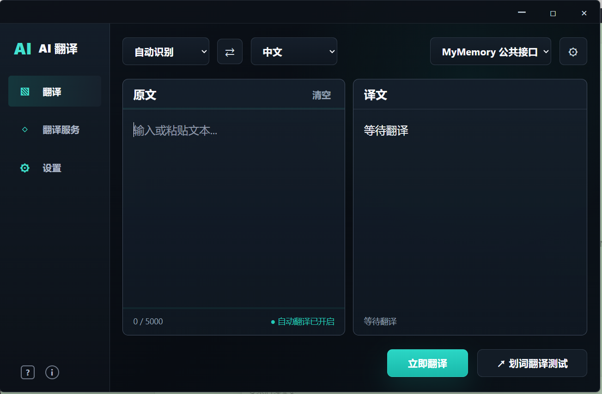

# AI 翻译

AI 翻译是一款基于 Tauri v2 的轻量桌面翻译工具。应用采用 Rust 后端处理全局快捷键、剪贴板、窗口控制、配置持久化和翻译请求，前端只负责极简交互界面，目标是保持低内存占用和快速响应。



## 下载

Windows 安装包：

[AI-Translate-0.1.0-x64-setup.exe](release/AI-Translate-0.1.0-x64-setup.exe)

## 功能概览

- 主界面翻译：输入或粘贴文本后自动翻译，也可以手动点击翻译。
- 全局划词翻译：在任意应用选中文字后按快捷键，在鼠标附近弹出悬浮翻译窗。
- 翻译服务切换：首页可直接选择 MyMemory、DeepSeek 或自定义 OpenAI 兼容服务。
- AI 服务配置：DeepSeek 只需要填写 API Key，Base URL、模型和 Agent 已内置。
- 自定义模型：支持添加其他 OpenAI 兼容服务，填写名称、Base URL、Model 和 API Key。
- 快捷键设置：支持自定义划词翻译快捷键和打开主界面快捷键。
- 启动方式：支持启动后打开主界面，或启动后仅驻留托盘。
- 主题切换：支持深色和浅色主题。
- 译文复制：译文区域提供一键复制。
- 桌面能力：支持托盘菜单、单例运行、窗口最小化、最大化和关闭。

## 技术架构

```text
Frontend (Vite + Vanilla JS + CSS)
  - 主界面输入、自动翻译、防抖、主题和设置交互
  - 悬浮窗展示划词结果

Tauri Commands
  - 前端调用 Rust 后端能力
  - 统一翻译、配置、复制、窗口控制接口

Rust Backend
  - 全局快捷键监听
  - 模拟 Ctrl+C 读取选中文本
  - 获取鼠标位置并移动悬浮窗
  - 调用 MyMemory / AI Provider 翻译接口
  - 保存应用配置和加密保存 API Key
```

## 目录结构

```text
.
├── docs/
│   └── images/                 # README 截图
├── index.html                  # 主窗口页面
├── popup.html                  # 划词翻译悬浮窗页面
├── src/
│   ├── main.js                 # 前端交互、状态和 Tauri command 调用
│   └── style.css               # 主界面、悬浮窗和主题样式
├── src-tauri/
│   ├── capabilities/           # Tauri 权限配置
│   ├── icons/                  # 应用和托盘图标
│   ├── src/
│   │   ├── app_state.rs        # 配置、Provider 和密钥持久化
│   │   ├── lib.rs              # Tauri 入口、窗口、托盘和命令
│   │   ├── main.rs             # 桌面入口
│   │   ├── shortcut.rs         # 全局快捷键、模拟复制和悬浮窗定位
│   │   └── translation.rs      # 翻译服务请求
│   ├── Cargo.toml
│   └── tauri.conf.json
├── package.json
└── pnpm-lock.yaml
```

## 本地开发

环境要求：

- Node.js 22+
- pnpm
- Rust stable
- Windows WebView2 Runtime

安装依赖：

```powershell
pnpm install
```

启动桌面开发版：

```powershell
pnpm desktop
```

前端生产构建：

```powershell
pnpm build
```

Rust 检查：

```powershell
cd src-tauri
cargo check
cargo clippy --all-targets -- -D warnings
```

打包 Windows 安装包：

```powershell
pnpm tauri build
```

Windows 发布目标当前使用 NSIS，打包产物位于：

```text
src-tauri/target/release/bundle/nsis/
```

## 翻译服务

### MyMemory

默认公共接口，无需 API Key，适合开箱即用和基础测试。

### DeepSeek

DeepSeek 使用 OpenAI 兼容接口，用户只需要在界面中填写 API Key：

```text
Base URL: https://api.deepseek.com
Model: deepseek-v4-flash
Endpoint: /chat/completions
```

内置 Agent 约束模型只输出译文，不输出解释、候选项、引用或 Markdown 包裹。

### 自定义 OpenAI 兼容服务

可在翻译服务配置中添加自定义服务：

- 名称
- Base URL
- Model
- API Key

## 配置与密钥

应用配置保存到系统应用配置目录，例如 Windows：

```text
%APPDATA%/com.codex.lighttranslate/config.json
```

API Key 不写入普通业务配置：

- 优先保存到系统凭据管理。
- Windows 下额外写入 DPAPI 加密后的 `secrets.json` 作为兜底。
- 前端只接收 `api_key_configured` 状态，不读取明文 Key。

## 快捷键

默认快捷键：

- 划词翻译：`Alt+Q`
- 打开主界面：`Ctrl+D`

快捷键可在设置中自定义，格式为：

```text
Alt/Ctrl/Shift + 字母或数字
```

示例：

```text
Alt+Q
Ctrl+E
Shift+Q
```

## 发布前检查

发布前建议执行：

```powershell
pnpm build
cd src-tauri
cargo check
cargo clippy --all-targets -- -D warnings
cd ..
pnpm tauri build
```

## 数据与安全边界

- 普通配置与密钥分离存储。
- API Key 不进入 README、源码、日志或前端持久化状态。
- 翻译请求由 Rust 后端发起，避免前端跨域问题。
- 应用打包产物、依赖目录和本地运行日志均通过 `.gitignore` 排除。
